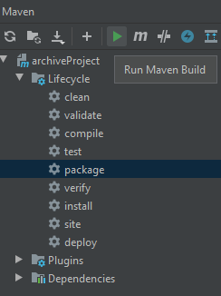

## Инструкция по запуску приложения
Склонировать проект и собрать проект в jar файл, либо загрузить .jar файл.
Создать jar файл можно при помощи maven используя команду package 
или же при помощи среды разработки
- 
####Запустить программу через коммандную строку с параметрами запуска
- **!zip** - для архивации
- **!unzip** - для деархивации
####Пример использования команд:
```
!zip путь_до_файла.file путь_до_директории путь_до_файла2.file путь_до_директории2
```
```
!unzip путь_до_архива.zip
```
По умолчанию имя заархивироанного архива default.zip

##Запуск в windows 10
Используя командную строку использовать команды для
архивации и деархивации
```
java -jar путь\до\файл.jar !unzip D:\new.zip
```
```
java -jar путь\до\файл.jar !zip D:\new file1.txt file2.mp3 D:\forZipDir
```

##Полезные ссылки
- **[Примеры java.util.zip](https://www.baeldung.com/java-compress-and-uncompress)**
- **[Примеры java.util.zip на русском](https://www.codeflow.site/ru/article/java-compress-and-uncompress)**
- **[Примеры архивации с использованием java 8](https://www.javadevjournal.com/java/zipping-and-unzipping-in-java/)**
- **[Проблема zip slip](https://snyk.io/research/zip-slip-vulnerability)**
- **[Проблема zip slip на русском](https://tproger.ru/news/zip-slip-vulnerability/)**